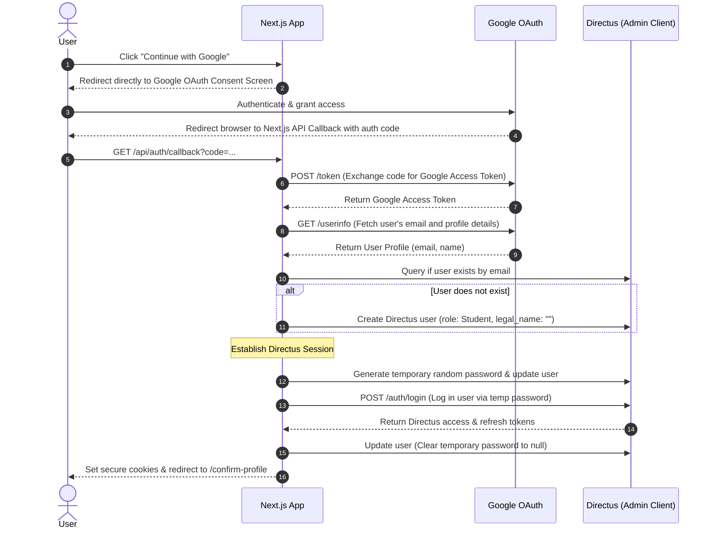

# Google OAuth Registration & Name Verification (Server-Side Flow)

This document outlines the security, compliance, and user experience considerations for integrating Google OAuth for user registration on the CPE Training Platform.

## 1. Trustworthiness of Google OAuth Details

### Email Address
*   **Trust level: High**
*   Google verifies email addresses during account creation and ownership changes. The OpenID Connect (OIDC) ID token/userinfo profile returned by Google contains an `email_verified` boolean field which is virtually always `true` for standard Gmail/Google accounts.
*   We can safely use this email as the unique identifier and primary contact for sending course materials and certificates.

### Profile Name (`name`, `given_name`, `family_name`)
*   **Trust level: Low (Unacceptable for Compliance)**
*   Google user profile names are self-reported. Users can easily set their name to a nickname, shorthand, initials, or pseudonyms (e.g. "Bob S.", "Jane", "Gamer99").
*   **Compliance Requirement:** Because the Continuing Professional Education (CPE) certificates are legal documents regulated by state boards (e.g., Texas Education Agency - TEA), printing anything other than the student's official legal name will invalidate the certificate.
*   **Conclusion:** We **cannot** use the name returned by Google OAuth directly on certificates without explicit user validation.

---

## 2. Server-Side Google OAuth Architecture

Because Directus runs on a separate domain (`directus-production-69c0.up.railway.app`) than the Next.js app (`localhost:3000`), native Directus SSO cookie-based login suffers from cross-origin browser security restrictions (e.g., third-party cookie blocking in Chrome/Safari). 

To ensure 100% reliability, the OAuth handshake is handled entirely **server-side** by Next.js, and the user is logged into Directus using a temporary secure password-exchange flow.



### Flow Step-by-Step
1.  **Authentication Trigger:** The user clicks "Continue with Google" on `/sign-in` or `/sign-up`.
2.  **Redirect to Google:** Next.js redirects the browser directly to Google's OAuth consent screen:
    `https://accounts.google.com/o/oauth2/v2/auth?client_id=...&redirect_uri=...&response_type=code&scope=openid%20email%20profile`
3.  **Callback Processing:** Google redirects the browser back to our Next.js API Callback:
    `${NEXT_PUBLIC_APP_URL}/api/auth/callback?code=...`
4.  **Google Token Exchange:** Next.js server calls Google's APIs to exchange the code and fetch the user's verified profile (`email`, `given_name`, `family_name`).
5.  **Directus User Lookup & Sync:** Next.js queries Directus using the Admin Client. If the user doesn't exist, they are created with the "Student" role and an empty `legal_name`.
6.  **Directus Session Creation:** 
    *   Next.js generates a secure random temporary password.
    *   Updates the user's Directus record with this password.
    *   Calls the standard `/auth/login` endpoint of Directus to retrieve the secure JWT `access_token` and `refresh_token`.
    *   Saves these tokens in local Next.js secure cookies (`directus_access_token` and `directus_refresh_token`).
    *   Clears the user's password in Directus (setting it back to `null`).
7.  **Profile Gating Redirect:** 
    *   If `legal_name` is empty or null: Redirect the user to `/confirm-profile`.
    *   If `legal_name` is present: Redirect the user to `/search` or their original page.

---

## 3. Configuration Requirements

This architecture requires **zero OIDC environment variables** on your Directus Railway dashboard, completely bypassing the previous configuration errors. 

All you need to do is add these credentials to your Next.js **`.env.local`** file (and later your Vercel/production environment):

```env
# Google OAuth Credentials (created in Google Cloud Console)
GOOGLE_CLIENT_ID="<your-google-client-id>"
GOOGLE_CLIENT_SECRET="<your-google-client-secret>"
```
